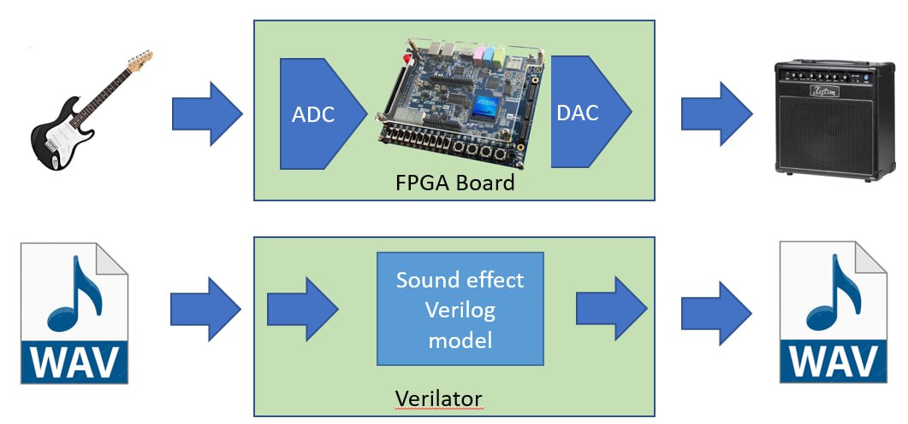
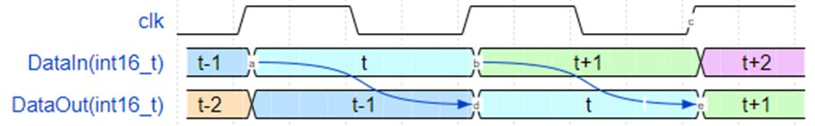

# Distortion



This repo can be used for educational purpose. Try to implement your own sound effect with using Verilog code.

Verilog HDL - is a Hardware Description Language, which is widely used in chip design. In order to make the abitily for test & debug your Verilog HDL code - Icarus Verilog or Verilator can be used for simulation purposed.

Verilog also can be used to create a Virtual environment like here - we run our distortion module inside verilator VM and can send WAV file to the input and get the result at output.

Later we can just flash the code to FPGA device.



Each clock cycle we load integer 16-bit sample to verilog module and each clock cycle get the processed result


## Sound Effects desctiption

* Echo is a reflection of sound that arrives at the listener with a delay after the direct sound. The delay is directly proportional to the distance of the reflecting surface from the source and the listener.
* Chorus - when individual sounds with approximately the same time, and very similar pitches, converge
* Distortion - used to alter the sound of amplified electric musical instruments, usually by increasing their gain, producing a "fuzzy", "growling", or "gritty" tone
* Reverbration - Reverberation is created when a sound or signal is reflected. This causes numerous reflections to build up and then decay as the sound is absorbed by the surfaces of objects in the space – which could include furniture, people, and air

## Installation

You may use docker file to run the environment

```
$git clone --recursive https://github.com/radiolok/distortionhdl.git
$ cd distortionhdl
$ sudo hwclock --hctosys //Optional
$ sudo docker build -t distortion .
$ sudo docker run --rm -it -v $(pwd):/var/vhdl --entrypoint /var/vhdl/run.sh distortion
```

### Manual setup

verilator is used to compile your Verilog HDL code to C++/SystecC module and execute it. 

Version presented in ubuntu repo is too old and do not support lint options.
```
sudo apt-get install git perl python3 gperf make autoconf g++ flex bison ccache
sudo apt-get install python-is-python3 python3-pip
sudo apt-get install libgoogle-perftools-dev numactl perl-doc help2man
sudo apt-get install libfl2  # Ubuntu only (ignore if gives error)
sudo apt-get install libfl-dev  # Ubuntu only (ignore if gives error)
sudo apt-get install zlibc zlib1g zlib1g-dev  # Ubuntu only (ignore if gives error)

git clone https://github.com/verilator/verilator   # Only first time

# Every time you need to build:
unsetenv VERILATOR_ROOT  # For csh; ignore error if on bash
unset VERILATOR_ROOT  # For bash
cd verilator
git pull         # Make sure git repository is up-to-date
git tag          # See what versions exist
git checkout v{version}  # Switch to specified release version

autoconf         # Create ./configure script
./configure      # Configure and create Makefile
make -j `nproc`  # Build Verilator itself (if error, try just 'make')
sudo make install
```

Icarus Verilog is an event-based Verilog simulator. in Ubuntu 22.04 repo Fresh version is already presented - just use sudo apt install iverilog instead of full compilation. Previous version doesn't catch $fatal; instruction correctly
```
sudo apt install gtkwave
git clone https://github.com/steveicarus/iverilog.git
cd iverilog
sh autoconf.sh
./configure
make -j`nproc`
sudo make install
```