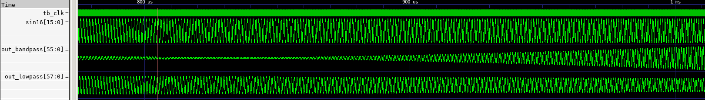

# FIR


In signal processing, a finite impulse response (FIR) filter is a filter whose impulse response (or response to any finite length input) is of finite duration, because it settles to zero in finite time. This is in contrast to infinite impulse response (IIR) filters, which may have internal feedback and may continue to respond indefinitely (usually decaying).

The impulse response (that is, the output in response to a Kronecker delta input) of an Nth-order discrete-time FIR filter lasts exactly 

## Run module test

```
sudo apt-get install verilog
sudo apt istall gtkwave
iverilog -o fir_test fir.sv fir_tb.sv
./fir_test
gtkwave out.vcd
```



## Calculate filter coef 
https://github.com/chipmuenk/pyfda/releases/tag/v0.7.1


